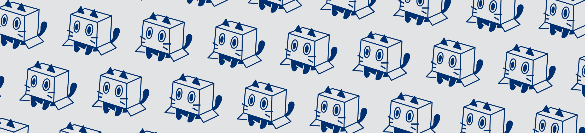

# Boxy

## Sobre Nós

Somos uma equipe de alunos do curso de Sistemas e Mídias Digitais (SMD) da Universidade Federal do Ceará (UFC). Estamos dedicados à produção de um trabalho acadêmico para a disciplina de "Projeto Integrado I".

## Nossa Missão

Nosso objetivo é desenvolver projetos inovadores que integrem tecnologia e mídia digital, contribuindo para a nossa formação acadêmica e preparando-nos para desafios reais do mercado.

## O Projeto

Nestes repositórios, você encontrará os materiais e os códigos desenvolvidos para o nosso projeto. Estamos focados em criar soluções práticas e eficazes, utilizando as habilidades adquiridas ao longo do curso.

## Equipe

- Alunos de Sistemas e Mídias Digitais (SMD)
- Universidade Federal do Ceará (UFC)
- Disciplina: Projeto Integrado I

Acompanhe nosso progresso e colabore com sugestões e feedbacks. Juntos, podemos criar algo incrível!

